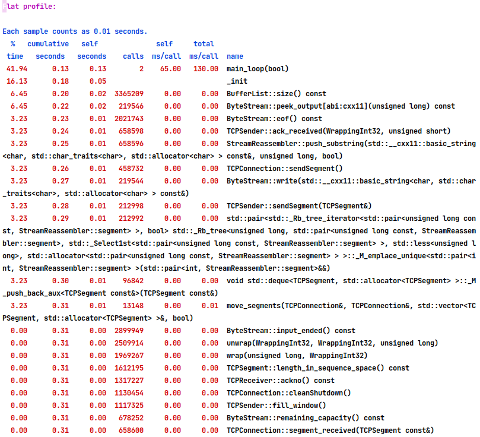
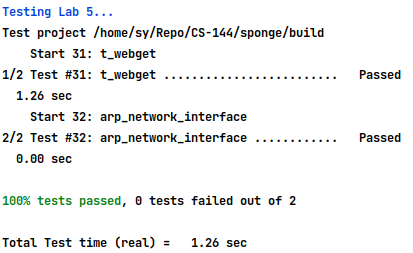
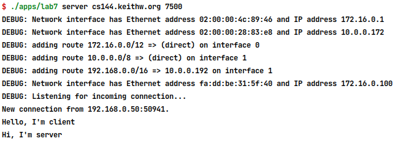
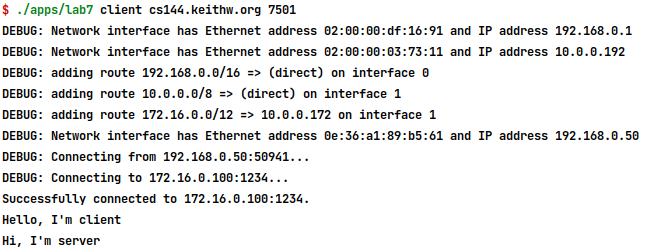
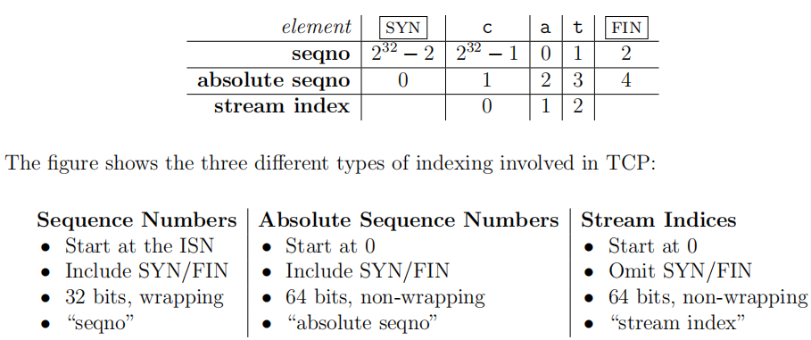
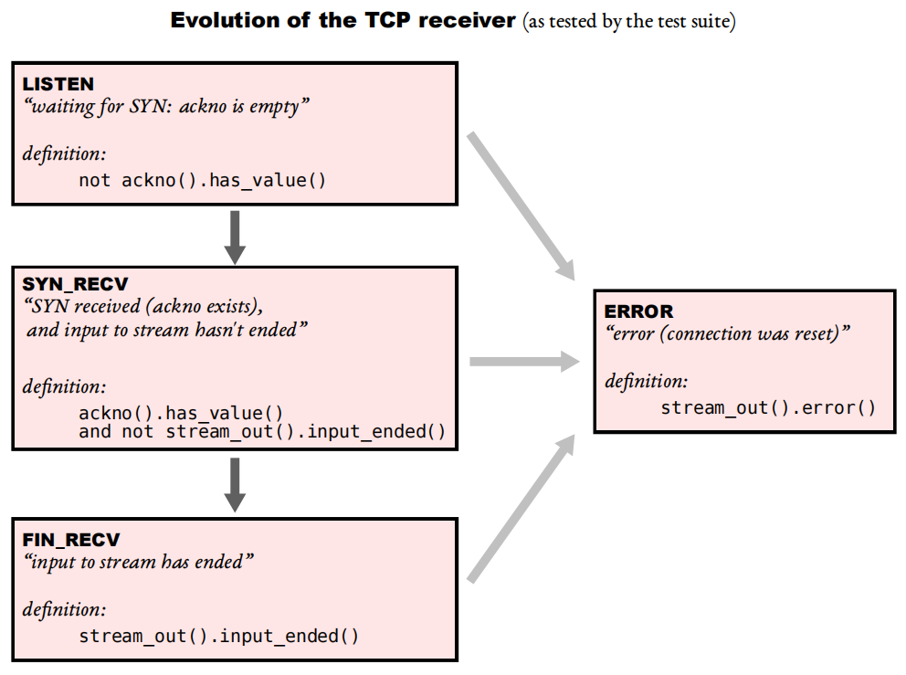
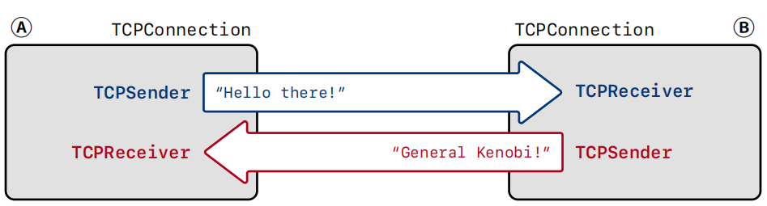
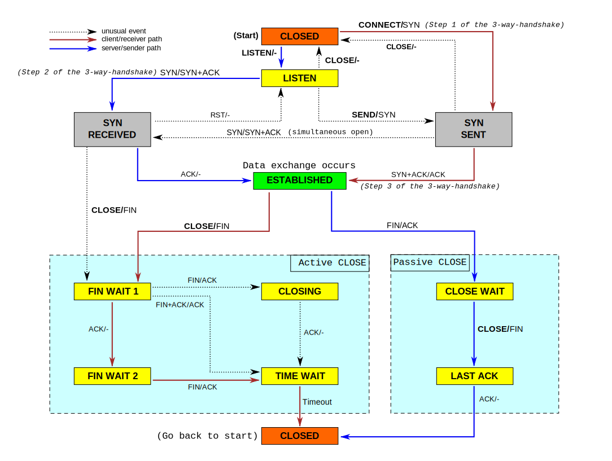
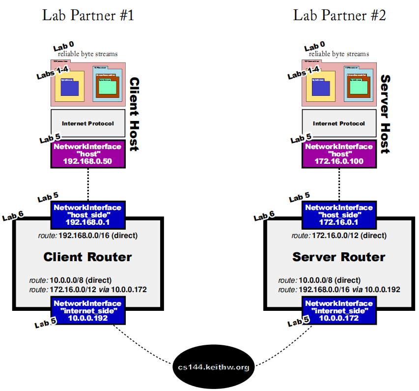

# CS144 Lab: A Simplified *Implementation* of the *TCP*

https://cs144.github.io/

## Deploy

```shell
git clone https://github.com/systemX1/sponge
mkdir build && cd build
cmake .. && make -j6 && make check_lab4               # test cases
./apps/tcp_benchmark                                  # benchmark
gprof ./apps/tcp_benchmark > tcp_benchmark_log.txt    # profiler

# Alsp you use docker
# in directory ~/Repo/others/CS-144/sponge
docker build -f DockerFile -t archlinux_cs144:latest .
docker run -it --privileged --cpus=6 archlinux_cs144:latest
```

## Benchmark




## Test Results

- [x] Lab 0: networking warmup
- [x] Lab 1: stitching substrings into a byte stream
- [x] Lab 2: the TCP receiver
- [x] Lab 3: the TCP sender
- [x] Lab 4: the TCP connection
- [x] Lab 5: the network interface
- [x] Lab 6: the IP router  
- [x] Lab7: putting it all together

Lab0-Lab4: Simplified TCP Implementation


Lab5: ARP



Lab6: Routing Table


Lab7: Putting it all together





## Arrangement


## Lab0 [networking warmup](https://cs144.github.io/assignments/lab0.pdf)

### Webget

Implement webget, a program to fetch Web pages over the Internet using the
operating system’s TCP support and stream-socket abstraction base on lab codes.

### ByteStream

Implement an in-memory reliable **byte stream**. 

The byte stream is finite: the writer can end the input, and then no more bytes can be written. When the reader has read to the end of the stream, it will reach “EOF” 
and no more bytes can be read.

Your byte stream will also be flow-controlled to limit its memory consumption at any given time. The object is initialized with a particular “capacity”: the maximum number of bytes.

It’s willing to store in its memory at any given point. The byte stream will limit the
writer in how much it can write at any given moment, to make sure that the stream doesn’t exceed its storage capacity.

#### API

for the writer:

```c++
// Write a string of bytes into the stream. Write as many
// as will fit, and return the number of bytes written.
size_t write(const std::string &data);
// Returns the number of additional bytes that the stream has space for
size_t remaining_capacity() const;
// Signal that the byte stream has reached its ending
void end_input();
// Indicate that the stream suffered an error
void set_error();
```

for the reader:

```c++
// Peek at next "len" bytes of the stream
std::string peek_output(const size_t len) const;
// Remove ``len'' bytes from the buffer
void pop_output(const size_t len);
// Read (i.e., copy and then pop) the next "len" bytes of the stream
std::string read(const size_t len);
bool input_ended() const; // `true` if the stream input has ended
bool eof() const; // `true` if the output has reached the ending
bool error() const; // `true` if the stream has suffered an error
size_t buffer_size() const; // the maximum amount that can currently be peeked/read
bool buffer_empty() const; // `true` if the buffer is empty
size_t bytes_written() const; // Total number of bytes written
size_t bytes_read() const; // Total number of bytes popped
```

#### My Implementation

[webget.cc](./apps/webget.cc)

P.S. We will Replace the TCPSocket type with CS144TCPSocket in lab4 to communicate with the actual world, the same version we implement.

[byte_stream.hh](./libsponge/byte_stream.hh) [byte_stream.cc](./libsponge/byte_stream.cc)

Use std::deque\<Buffer\> as the underlying storage structure of  the class ByteStream. Buffer is a class encapsulate the std::shared_ptr\<std::string\> to support pop_front operation.


## Lab1 [stitching substrings into a byte stream](https://cs144.github.io/assignments/lab1.pdf)

### StreamReassembler

The TCP sender is dividing its byte stream up into short segments (substrings no more than about 1,460 bytes apiece) so that they each fit inside a datagram. But the network might **reorder** these datagrams, or **drop** them, or deliver them **more than once**.

In Lab 1, you’ll implement a **stream reassembler**—a module that stitches small pieces of the byte stream (known as substrings, or segments) back into a contiguous stream of bytes in the correct sequence.


**Example:**	

#### API

```c++
// Construct a `StreamReassembler` that will store up to `capacity` bytes.
StreamReassembler(const size_t capacity);
// Receive a substring and write any newly contiguous bytes into the stream,
// while staying within the memory limits of the `capacity`. Bytes that would
// exceed the capacity are silently discarded.
//
// `data`: the substring
// `index` indicates the index (place in sequence) of the first byte in `data`
// `eof`: the last byte of this substring will be the last byte in the entire stream
void push_substring(const string &data, const uint64_t index, const bool eof);
// Access the reassembled ByteStream (your code from Lab 0)
ByteStream &stream_out();
// The number of bytes in the substrings stored but not yet reassembled
size_t unassembled_bytes() const;
```

#### My Implementation

[stream_reassembler.cc](./libsponge/stream_reassembler.cc) [stream_reassembler.hh](./libsponge/stream_reassembler.hh)

```c++
// class declaration
class StreamReassembler {
  private:
    // Your code here -- add private members as necessary.
    struct segment {
        segment() = delete;
        explicit segment(const std::string &d) : data(d) {}
        size_t len() const {return data.length();}
        bool empty() const {return !data.length();}
        std::string data;
    };
    std::map<size_t, segment> _bufferMap;
    ByteStream _output;  //!< The reassembled in-order byte stream
    size_t _capacity;    //!< The maximum number of bytes
    size_t _firstUnassembledIndex;  //!< The next unread index
    size_t _unassembledByte;   //!< The number of unassembled bytes
    bool _isEOF;       //!< eof
    ...
}
```

Use std::map<size_t, segment> (key: index, value: unassembled bytes) to store current unassembled bytes,  red-black tree guarantees searching, insert and delete operations in O(log n) time.

```c++
void StreamReassembler::push_substring(const string &data, size_t index, bool eof) {
    _isEOF |= eof;
    // pre process the data
    if (index >= _firstUnassembledIndex + _capacity)  // over capacity, discard it
        return;
    segment seg(data);
    if(index + seg.len() > _firstUnassembledIndex + _capacity ) { // partially over capacity, truncate the input string
        _isEOF = false;
        seg.data.assign(seg.data.begin(), seg.data.begin() + static_cast<long>(_firstUnassembledIndex + _capacity - index));
    } else if(data.empty() || index + data.length() <= _firstUnassembledIndex) {       // empty data or redundant reassembled segment
        if(_isEOF && !_unassembledByte && !stream_out().input_ended()) {
            stream_out().end_input();
        }
        return;
    }
    if(index < _firstUnassembledIndex) {           // partially before _firstUnassembledIndex, truncate the input string
        seg.data.assign(seg.data.begin() + static_cast<long>(_firstUnassembledIndex - index), seg.data.end());
        index = _firstUnassembledIndex;
    }

    // append the new data
    auto lastSeg = (_bufferMap.empty() || _bufferMap.size() == 1 || _bufferMap.upper_bound(index) == _bufferMap.begin())
                        ? _bufferMap.begin()
                        : prev(_bufferMap.upper_bound(index));   // find the greatest key not greater than val
    if(!_bufferMap.empty() && isOverlap(lastSeg->first, lastSeg->second.len(), index) ) {
        size_t overlap = appendSegment(lastSeg->first, lastSeg->second.data, index, seg.data);
        _unassembledByte += (seg.len() - overlap);
    } else {
        _bufferMap.insert(pair<int, segment>(index, seg));
        lastSeg = _bufferMap.find(index);
        _unassembledByte += seg.len();
    }

    // remove overlap segment
    for(auto lastSeg2 = _bufferMap.upper_bound(lastSeg->first);
        lastSeg2 != _bufferMap.end() && lastSeg2->first < lastSeg->first + lastSeg->second.len();
        lastSeg2 = _bufferMap.upper_bound(lastSeg->first)) {
        _unassembledByte -= appendSegment(lastSeg->first, lastSeg->second.data, lastSeg2->first, lastSeg2->second.data);
        _bufferMap.erase(lastSeg2->first);
    }

    // write to the ByteStream _output
    while (!_bufferMap.empty() && _bufferMap.begin()->first == _firstUnassembledIndex) {
        size_t write_byte = _output.write(_bufferMap.begin()->second.data);
        _firstUnassembledIndex += write_byte;
        _unassembledByte -= write_byte;
        _bufferMap.erase(_bufferMap.begin());
    }

    // let output steam stop
    if (empty() && _isEOF && !stream_out().input_ended()) {
        _output.end_input();
    }
}
```


## Lab2 [the TCP receiver](https://cs144.github.io/assignments/lab2.pdf)

Sequence wraparound

### Translating between 64-bit indexes and 32-bit seqnos

Converting between sequence numbers(ISN) and absolute sequence numbers.



#### API

```c++
// Given an absolute sequence number (n) and an Initial Sequence Number (isn), produce the (relative) sequence number for n.
WrappingInt32 wrap(uint64 t n, WrappingInt32 isn);
// Given a sequence number (n), the Initial
// Sequence Number (isn), and an absolute checkpoint sequence number, compute the
// absolute sequence number that corresponds to n that is closest to the checkpoint.
uint64 t unwrap(WrappingInt32 n, WrappingInt32 isn, uint64 t checkpoint);
```

#### My Implementation

[wrapping_integers.cc](./libsponge/wrapping_integers.cc)  [wrapping_integers.hh](./libsponge/wrapping_integers.hh)

It is easier to implement the `wrap` , absolute sequence number modulo UINT32_MAX then plus isn.

```c++
WrappingInt32 wrap(uint64_t n, WrappingInt32 isn) {
     return WrappingInt32{static_cast<uint32_t>((n & UINT32_MAX) + isn.raw_value() ) };
}
```

The absolute value of `steps` is the minimum difference between uint32 numbers n and checkpoint modulo UINT32_MAX.

```c++
uint64_t unwrap(WrappingInt32 n, WrappingInt32 isn, uint64_t checkpoint) {
    int32_t steps = n.raw_value() - static_cast<uint32_t>((checkpoint & UINT32_MAX) + isn.raw_value() );
    int64_t ret = checkpoint + steps;
    return ret >= 0 ? ret : ret + (1ul << 32);
}
```


### TCP receiver


The TCPReceiver is built around your StreamReassembler. TCPReceiver::segment received() will be called each time a new segment is received from the peer. 



#### API

```c++
// Construct a `TCPReceiver` that will store up to `capacity` bytes
TCPReceiver(const size_t capacity); // implemented for you in .hh file
// Handle an inbound TCP segment
void segment_received(const TCPSegment &seg);
```

#### My Implementation

[tcp_receiver.cc](./libsponge/tcp_receiver.cc) [tcp_receiver.hh](./libsponge/tcp_receiver.hh)


## Lab3 [the TCP sender](https://cs144.github.io/assignments/lab3.pdf)

### TCP sender


#### API

```c++
// A segment is received from the receiver, conveying the new left (= ackno) and right (=
// ackno + window size) edges of the window. The TCPSender should look through its
// collection of outstanding segments and remove any that have now been fully acknowledged (the ackno is greater than all of the sequence numbers in the segment). The
// TCPSender should fill the window again if new space has opened up.
void ack_received(WrappingInt32 ackno, uint16_t window_size);
// Create and send segments to fill as much of the window as possible
void fill_window();
// A certain number of milliseconds since the last time this method
// was called. The sender may need to retransmit an outstanding segment.
void tick(size_t ms_since_last_tick);
// Generate an empty-payload segment (useful for creating empty ACK segments)
void send_empty_segment();
```

#### My Implementation

[tcp_receiver.cc](./libsponge/tcp_receiver.cc) [tcp_receiver.hh](./libsponge/tcp_receiver.hh)


## Lab4 [the TCP connection](https://cs144.github.io/assignments/lab4.pdf)

### TCP connection


**Receiving segments.** As shown on Figure 1, the TCPConnection receives TCPSegments

from the Internet when its segment received method is called. When this happens, the

TCPConnection looks at the segment and:

- if the rst (reset) flflag is set, sets both the inbound and outbound streams to the error

state and kills the connection permanently. Otherwise it. . .

- gives the segment to the TCPReceiver so it can inspect the fifields it cares about on

incoming segments: seqno, syn , payload, and fin . 

- if the ack flflag is set, tells the TCPSender about the fifields it cares about on incoming

segments: ackno and window size. 

- if the incoming segment occupied any sequence numbers, the TCPConnection makes

sure that *at least one* segment is sent in reply, to reflflect an update in the ackno and

window size.

- There is one extra special case that you will have to handle in the TCPConnection’s

segment received() method: responding to a “keep-alive” segment. The peer *may*

choose to send a segment with an invalid sequence number to see if your TCP imple

mentation is still alive (and if so, what your current window is). Your TCPConnection

should reply to these “keep-alives” **even though they do not occupy any sequence**

**numbers**. 


**Sending segments.** The TCPConnection will send TCPSegments over the Internet:

- **any time** the TCPSender has pushed a segment onto its outgoing queue, having set the

fifields it’s responsible for on outgoing segments: (seqno, syn , payload, and fin ).

- Before sending the segment, the TCPConnection will ask the TCPReceiver for the fifields

it’s responsible for on outgoing segments: ackno and window size. If there is an ackno,

it will set the ack flflag and the fifields in the TCPSegment.


**When time passes.** The TCPConnection has a tick method that will be called periodically

by the operating system. When this happens, the TCPConnection needs to:

- tell the TCPSender about the passage of time.

- abort the connection, and send a reset segment to the peer (an empty segment with

the rst flflag set), if the number of consecutive retransmissions is more than an upper

limit TCPConfig::MAX RETX ATTEMPTS. 

- end the connection cleanly if necessary (please see Section 5)

#### API

The full interface for the TCPConnection is in the doc [CS144](https://cs144.github.io/doc/lab4/class_t_c_p_connection.html).

#### My Implementation

[tcp_connection.cc](./libsponge/tcp_connection.cc) [tcp_connection.hh](./libsponge/tcp_connection.hh)

Implement the tcp state machine.

```c++
enum State{
        LISTEN = 0ul, SYN_RCVD, SYN_SENT, ESTABLISHED, CLOSE_WAIT, LAST_SACK,
        FIN_WAIT_1, FIN_WAIT_2, CLOSING, TIME_WAIT, CLOSED
};
```





## Lab5 [the network interface](https://cs144.github.io/assignments/lab5.pdf)

### The Address Resolution Protocol

#### API

```c++
// This method is called when the caller (e.g., your TCPConnection or a router) wants to send an outbound Internet (IP) datagram to the next hop.
void NetworkInterface::send_datagram(const InternetDatagram &dgram,
const Address &next_hop);
// This method is called when an Ethernet frame arrives from the network. The code
// should ignore any frames not destined for the network interface (meaning, the Ethernet
// destination is either the broadcast address or the interface’s own Ethernet address
// stored in the ethernet address member variable).
optional<InternetDatagram> NetworkInterface::recv_frame(const EthernetFrame &frame);
// Called as time passes. Expire any IP-to-Ethernet mappings that have expired.
void NetworkInterface::tick(const size_t ms_since_last_tick);
```

#### My Implementation

[network_interface.cc](./libsponge/network_interface.cc) [network_interface.hh](./libsponge/network_interface.hh)

Main data structure:

```c++
class NetworkInterface {
  private:
    struct ARPEntry {
            EthernetAddress eth_addr;
            size_t time;
        };
    // key: ip, val: ARPEntry
    std::unordered_map<uint32_t, ARPEntry> _arp_table{};
    // key: ip, val: the time when ethernet frame sent
    std::unordered_map<uint32_t, size_t> _no_responded_frames{};
    // key: ipv4 addr, val: InternetDatagram
    std::list<std::pair<Address, InternetDatagram>> _unsent_datagrams{};
    ...
}
```


## Lab6 [the IP router](https://cs144.github.io/assignments/lab6.pdf)

Among the matching routes, the router chooses the route with the biggest value of
prefix length. This is the **longest-prefix-match route**.

### Router

#### API

```c++
// Register 
void add_route(const uint32_t route_prefix,
    const uint8_t prefix_length,
    const optional<Address> next_hop,
    const size_t interface_num);
// Send datagram
void route_one_datagram(InternetDatagram &dgram);
```

#### My Implementation

[router.cc](./libsponge/router.cc) [router.hh](./libsponge/router.hh)

Main data structure:

```c++
class Router {
    struct RouteEntry {
     struct RouteEntry {
        uint32_t route_prefix;
        uint8_t prefix_length;
        std::optional<Address> next_hop;
        size_t interface_num;
    };
	std::vector<RouteEntry> _routing_table{};
        ...
}
```


## Lab7 [putting it all together](https://cs144.github.io/assignments/lab7.pdf)

In this lab, you won’t need to do any coding (assuming your previous labs are in
reasonable working shape). Instead, to cap off your accomplishment, you’re going to use all
of your previous labs to create a real network that includes your network stack (host and
router) talking to the network stack implemented by another student in the class.



Lab7: Putting it all together


